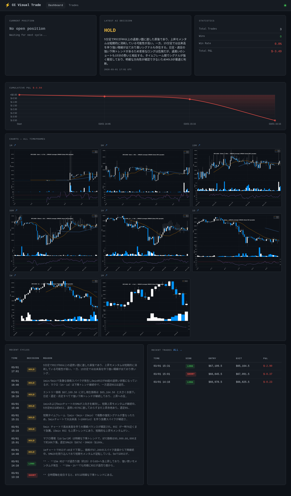

# CC Visual Trade

Hyperliquid の **8つの時間軸チャート** を **Claude Code CLI** に画像分析させ、`LONG / SHORT / EXIT / HOLD` を自動判断して執行する自動売買 bot。



## アーキテクチャ

```
毎15分 (APScheduler)
  ↓
1. Hyperliquid から 8時間軸の OHLCV を取得 → mplfinance で PNG 生成
   1m / 5m / 15m / 30m / 1h / 1d / 1w / 1M
   (ローソク足 + SMA20 + SMA50 + RSI + 出来高)
  ↓
2. claude -p "..." --allowedTools Read,Bash --permission-mode bypassPermissions
   ├─ Claude が Read ツールで全チャートを分析
   ├─ LONG  → Bash: python script/long.py  (指値 → 30秒 → 成り行き)
   ├─ SHORT → Bash: python script/short.py (指値 → 30秒 → 成り行き)
   ├─ EXIT  → ポジションをクローズ
   └─ HOLD  → 何もしない
  ↓
3. 判断・実行結果を SQLite に記録

毎30秒
  → オープンポジションが1時間経過 → 指値決済 → 60秒 → 成り行き決済
```

## 機能

- **マルチタイムフレーム分析**: 1m〜月足の8枚を Claude に同時提示
- **AI判断**: チャート画像から LONG / SHORT / EXIT / HOLD を自律判断・実行
- **注文執行**: 指値優先（メイカー手数料）→ 未約定で成り行きフォールバック
- **強制決済**: 1時間後に必ず決済（指値60秒 → 成り行き）
- **プロンプト外部管理**: `prompt/context.md` を編集するだけでAIへの指示を変更可能（rebuild 不要）
- **ダッシュボード**: FastAPI + Jinja2 (ポート 8080)
  - 現在ポジション・決済カウントダウン
  - 累計 P&L 推移グラフ（エクイティカーブ）
  - 全時間軸チャートグリッド（8枚）
  - Claude の判断とその理由（Markdown レンダリング）
  - 取引履歴・勝率・累計 P&L

## 技術スタック

| 役割 | 技術 |
|------|------|
| AI 判断 | Claude Code CLI (`claude -p`) |
| チャート生成 | mplfinance + matplotlib |
| P&L グラフ | Chart.js 4.4 |
| 取引 | hyperliquid-python-sdk |
| スケジューラ | APScheduler |
| Web | FastAPI + Jinja2 |
| DB | SQLite + SQLAlchemy |
| コンテナ | Docker Compose |

## セットアップ

### 1. 環境変数を設定

```bash
cp .env.example .env
```

`.env` を編集:

```env
HYPERLIQUID_PRIVATE_KEY=0x_your_api_wallet_private_key
HYPERLIQUID_ACCOUNT_ADDRESS=0x_your_api_wallet_address
HYPERLIQUID_MAIN_ADDRESS=0x_your_main_account_address
TRADING_COIN=BTC
POSITION_SIZE_USD=100
LEVERAGE=3
TESTNET=false       # true でテストネット使用
DRY_RUN=true        # 最初は true で動作確認
DASHBOARD_PORT=8080
```

### 2. Claude Code CLI の認証

ホスト側で一度ログインすれば、認証情報が Docker コンテナに自動マウントされます。

```bash
claude auth login
```

### 3. 起動

```bash
docker compose up --build
```

ダッシュボード: http://localhost:8080

### 4. 本番稼働

動作確認後、`.env` の `DRY_RUN=false` に変更して再起動。

```bash
docker compose restart
```

## ディレクトリ構成

```
CC_Visual_Trade/
├── main.py                  # エントリポイント (FastAPI + APScheduler)
├── prompt/
│   └── context.md           # Claude への取引ルール・コンテキスト (rebuild 不要で編集可)
├── script/
│   ├── long.py              # Long 注文ロジック
│   └── short.py             # Short 注文ロジック
├── .claude/commands/
│   ├── long.md              # /long スキル定義
│   └── short.md             # /short スキル定義
├── src/
│   ├── chart.py             # マルチ時間軸チャート生成
│   ├── orchestrator.py      # Claude CLI 呼び出し・レスポンス解析
│   ├── trader.py            # 1時間強制決済ロジック
│   ├── database.py          # SQLite モデル (Trade / Cycle)
│   ├── dashboard.py         # FastAPI ルーター
│   └── config.py            # 環境変数設定
├── templates/               # Jinja2 テンプレート (volume mount)
├── static/                  # CSS (volume mount)
├── charts/                  # 生成チャート PNG — サイクルごとに上書き
└── data/                    # SQLite DB
```

## プロンプトのカスタマイズ

`prompt/context.md` を編集するだけで Claude への指示を変更できます。
コンテナの再起動・再ビルドは不要です。

```
prompt/context.md  ← ここを編集
```

## テスト

Hyperliquid テストネットへの実注文を含む統合テストです。`.env` に `TESTNET=true` を設定した状態で実行してください。

```bash
# コンテナ内で実行
docker compose exec app python -m pytest tests/ -v -s
```

| テストクラス | 内容 |
|-------------|------|
| `TestPnlCalc` | `calc_pnl()` のユニットテスト（ネットワーク不要） |
| `TestMarketData` | mid価格・OHLCV取得・`_fetch_mid` の疎通確認 |
| `TestOrderPlacement` | 指値注文→キャンセル、成行エントリー→GTC決済注文の実注文テスト |

> **注意**: `TestOrderPlacement` はテストネットに実際の注文を発行します（〜$11相当）。`TESTNET=true` でない場合はテスト開始時に自動終了します。

## 注意事項

- 本ソフトウェアは教育・研究目的です
- 実際の資金を使う場合は自己責任で
- `DRY_RUN=true` で十分テストしてから本番稼働させてください
