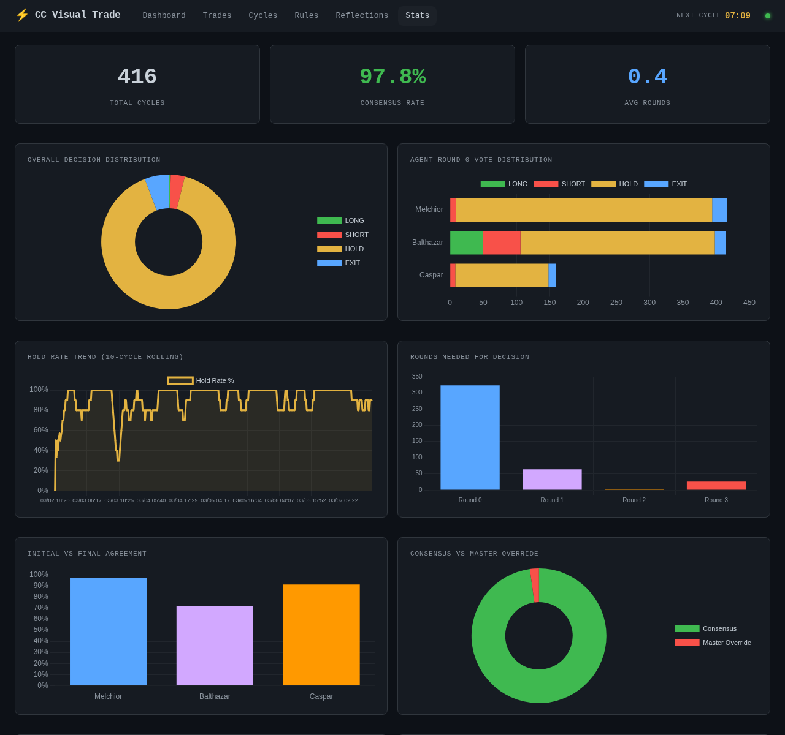
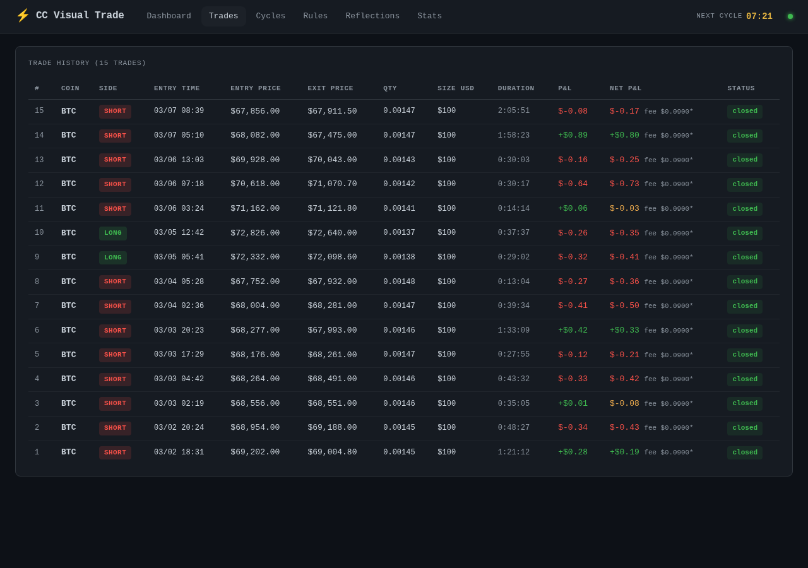
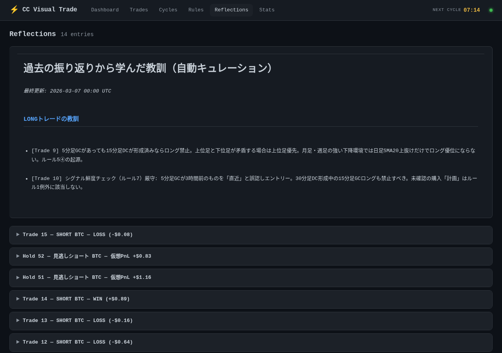
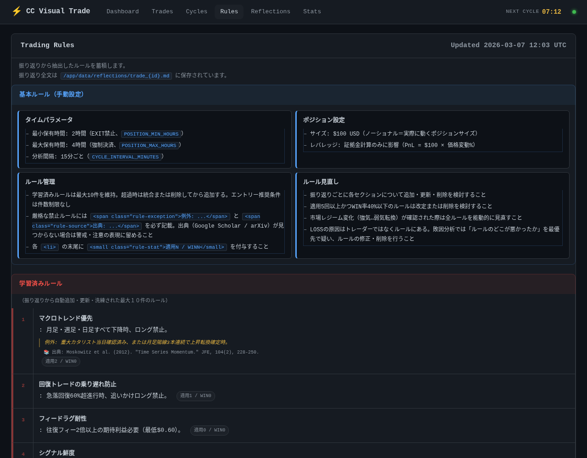
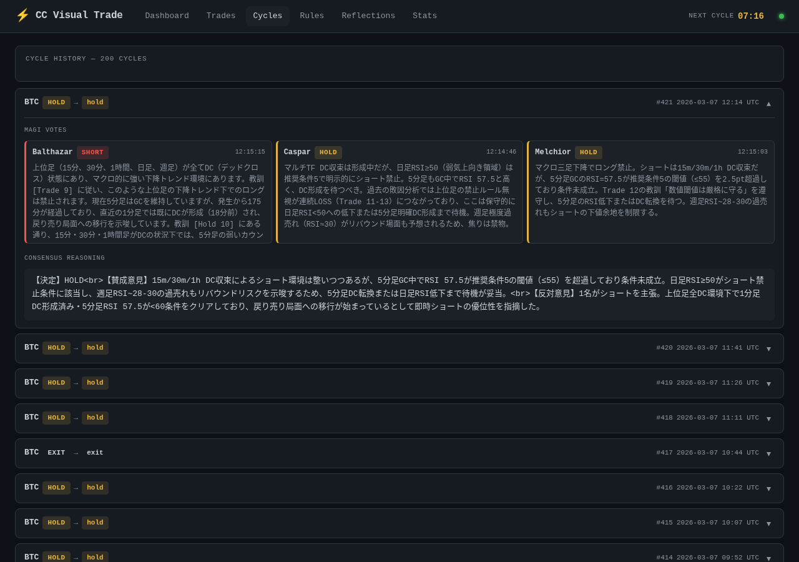

# CC Visual Trade

Hyperliquid 上で BTC を自動売買する AI トレーディングボット。
**8つの時間軸チャート**を **Claude Code CLI** に画像分析させ、マルチエージェント合議（MAGI System）で `LONG / SHORT / EXIT / HOLD` を判断・執行する。

トレード結果は自動的に振り返り → ルール更新 → 仮説蓄積のサイクルで継続的に学習する。

## Dashboard

| メイン画面 | 統計 |
|:---:|:---:|
|  |  |

| トレード履歴 | 振り返り |
|:---:|:---:|
|  |  |

| ルール表示 | サイクルログ |
|:---:|:---:|
|  |  |

## アーキテクチャ

```
┌─────────────────────────────────────────────────────┐
│                    APScheduler                       │
│  ┌───────────────┐  ┌──────────┐  ┌──────────────┐ │
│  │ Trading Cycle │  │ Close    │  │ Digest       │ │
│  │ (every 60min) │  │ Check    │  │ (every 12h)  │ │
│  │               │  │ (30sec)  │  │              │ │
│  └───────┬───────┘  └────┬─────┘  └──────┬───────┘ │
└──────────┼───────────────┼───────────────┼──────────┘
           │               │               │
           ▼               ▼               ▼
    ┌─────────────┐  ┌──────────┐  ┌─────────────┐
    │  Chart Gen  │  │  Trader  │  │   Digest    │
    │ (mplfinance)│  │ (close / │  │  (Claude    │
    │  8 TF PNGs  │  │ emergency│  │  subprocess)│
    └──────┬──────┘  └──────────┘  └─────────────┘
           │
           ▼
    ┌─────────────────────────────┐
    │        MAGI System          │
    │  ┌─────────┐ ┌───────────┐ │
    │  │Melchior │ │ Balthazar │ │    Round 0: 独立分析
    │  │(Claude) │ │ (Gemini)  │ │    Round 1: 相互参照
    │  └────┬────┘ └─────┬─────┘ │    Round 2: Web検索
    │       └──────┬─────┘       │    Round 3: 最終判定
    │              ▼             │
    │     Majority Vote          │
    └──────────┬─────────────────┘
               │
     ┌─────────┼─────────┐
     ▼         ▼         ▼
  ┌──────┐ ┌──────┐ ┌──────┐
  │ LONG │ │SHORT │ │ HOLD │
  │ 指値→│ │ 指値→│ │      │
  │ 成行 │ │ 成行 │ │      │
  └──┬───┘ └──┬───┘ └──┬───┘
     │        │        │
     ▼        ▼        ▼
  ┌────────────────────────┐
  │      SQLite (DB)       │
  │  Trade / Cycle / Vote  │
  └────────────┬───────────┘
               │
     ┌─────────┼──────────┐
     ▼         ▼          ▼
  ┌──────┐ ┌────────┐ ┌────────┐
  │Post- │ │ Hold   │ │Hypothe-│
  │Trade │ │Reflect.│ │sis     │
  │振り返│ │見逃し  │ │Queue   │
  │り    │ │分析    │ │仮説管理│
  └──┬───┘ └───┬────┘ └───┬────┘
     └─────────┼──────────┘
               ▼
        ┌────────────┐
        │ AGENTS.md  │
        │ ルール自動 │
        │ 更新・洗練 │
        └────────────┘
```

## 主な機能

### 分析・判断

- **マルチタイムフレーム分析**: 1m / 5m / 15m / 30m / 1h / 1d / 1w / 1M の8枚のチャート（ローソク足 + SMA20/50 + RSI + 出来高）を同時分析
- **MAGI System**: EVA 初号機インスパイアのマルチエージェント合議。Claude (Melchior) と Gemini (Balthazar) が4ラウンドの議論を経て多数決で意思決定
- **緊急モニタリング**: 30秒間隔でポジションを監視、急激な損益変動時に緊急 MAGI セッションを発動

### 注文執行

- **指値優先**: メイカー手数料で指値注文 → 30秒タイムアウト → 未約定なら成り行きフォールバック
- **自動決済**: 最大保有時間（デフォルト4時間）経過で強制決済（指値60秒 → 成り行き）
- **最小保有時間**: デフォルト2時間はEXIT判断を抑制（ノイズ回避）
- **リアルタイムフィー取得**: Hyperliquid API から実際の手数料を取得、Net P&L を正確に計算

### 学習・振り返り

- **Post-Trade Reflection**: 各トレード終了後、Claude がチャートと結果を分析し振り返りを自動生成。`AGENTS.md` のルールを自動更新
- **Hold Reflection**: HOLD 判断の見逃しチャンスを4時間後に検証。「入るべきだった」ケースからも学習
- **Reflection Digest**: 12時間ごとに全振り返りをインパクト順に要約。次回 MAGI プロンプトに注入
- **Hypothesis Queue**: 振り返りで生まれた低確信度の気づきや矛盾する観察を仮説として保持。2回以上支持されたらルールに昇格、否定されたら削除
- **ルール整合性チェック**: ルール更新時に全ルールを擬似コードに変換し、論理的矛盾がないか自動検証
- **学術的根拠**: 厳格な禁止ルールには学術論文の出典を要求（Google Scholar / arXiv）

### ダッシュボード

- **Dashboard**: 現在のポジション、MAGI 投票結果、決済カウントダウン、全時間軸チャートグリッド、Claude の判断理由
- **Trades**: 全取引履歴（Gross P&L / Net P&L / フィー）
- **Cycles**: 全サイクルログ（分析理由の Markdown レンダリング）
- **Rules**: `AGENTS.md` のルール表示（学習済みルール + エントリー推奨条件）
- **Reflections**: 振り返りダイジェスト + 未解決の仮説キュー + 個別振り返り一覧
- **Stats**: 勝率・P&L推移・決断分布・時間帯分析などの統計ダッシュボード

### インフラ

- **Discord 通知**: トレード実行・決済・緊急イベントを Discord チャンネルに自動通知
- **Cloudflare Quick Tunnel**: 無料・アカウント不要でダッシュボードを外部公開
- **Docker Compose**: ワンコマンドで環境構築。ソースコードはホットリロード対応（volume mount）
- **プロンプト外部管理**: `prompt/context.md` を編集するだけで AI への指示を変更（rebuild 不要）

## 技術スタック

| 役割 | 技術 |
|------|------|
| AI 判断 (Melchior) | Claude Code CLI (`claude -p`) |
| AI 判断 (Balthazar) | Gemini CLI (`gemini`) |
| チャート生成 | mplfinance + matplotlib |
| P&L グラフ | Chart.js 4.4 |
| 取引所 | Hyperliquid (hyperliquid-python-sdk) |
| スケジューラ | APScheduler |
| Web | FastAPI + Jinja2 + Uvicorn |
| DB | SQLite + SQLAlchemy |
| コンテナ | Docker Compose |
| 通知 | Discord Bot API |
| 外部公開 | Cloudflare Quick Tunnel |

## セットアップ

### 1. 環境変数を設定

```bash
cp .env.example .env
```

`.env` を編集:

```env
# Hyperliquid 認証
HYPERLIQUID_PRIVATE_KEY=0x_your_api_wallet_private_key
HYPERLIQUID_ACCOUNT_ADDRESS=0x_your_api_wallet_address
HYPERLIQUID_MAIN_ADDRESS=0x_your_main_account_address

# トレード設定
TRADING_COIN=BTC
POSITION_SIZE_USD=100
LEVERAGE=3

# タイミング
CYCLE_INTERVAL_MINUTES=60      # 分析サイクル間隔
POSITION_MIN_HOURS=2           # 最小保有時間
POSITION_MAX_HOURS=4           # 最大保有時間（強制決済）

# 安全設定
TESTNET=false                  # true でテストネット使用
DRY_RUN=true                   # 最初は true で動作確認

# ダッシュボード
DASHBOARD_PORT=8080

# Discord 通知（任意）
DISCORD_BOT_TOKEN=
DISCORD_CHANNEL_ID=

# 緊急モニタリング閾値
EMERGENCY_LOSS_PCT=3.0         # 含み損 % でトリガー
EMERGENCY_PROFIT_PCT=5.0       # 含み益 % でトリガー
EMERGENCY_PRICE_MOVE_PCT=2.0   # 急変 % でトリガー
```

### 2. Claude Code CLI の認証

ホスト側で一度ログインすれば、認証情報が Docker コンテナに自動マウントされます。

```bash
claude auth login
```

Gemini CLI も使用する場合:

```bash
gemini auth login
```

### 3. 起動

```bash
docker compose up --build
```

ダッシュボード: http://localhost:8080

### 4. 本番稼働

動作確認後、`.env` の `DRY_RUN=false` に変更して再起動。

```bash
docker compose restart
```

## ディレクトリ構成

```
CC_Visual_Trade/
├── main.py                     # エントリポイント (FastAPI + APScheduler)
├── AGENTS.md                   # AI 学習ログ（ルール自動更新）
├── docker-compose.yml
├── Dockerfile
│
├── prompt/
│   └── context.md              # Claude への取引ルール・コンテキスト (rebuild 不要で編集可)
│
├── src/
│   ├── orchestrator.py         # Claude CLI 呼び出し・レスポンス解析
│   ├── magi.py                 # MAGI System（マルチエージェント合議）
│   ├── chart.py                # マルチ時間軸チャート生成 (mplfinance)
│   ├── trader.py               # ポジション管理・強制決済
│   ├── emergency.py            # 緊急ポジションモニタリング
│   ├── reflection.py           # Post-Trade 振り返り（Claude subprocess）
│   ├── hold_reflection.py      # Hold 見逃し分析
│   ├── digest.py               # 振り返りダイジェスト生成
│   ├── database.py             # SQLite モデル (Trade / Cycle / MagiVote / HoldOpportunity)
│   ├── dashboard.py            # FastAPI ルーター (6ページ + API)
│   ├── config.py               # 環境変数設定 (Pydantic Settings)
│   ├── notify.py               # Discord 通知
│   ├── discord_bot.py          # Discord Bot (トンネルURL通知等)
│   └── state.py                # ランタイム状態管理
│
├── script/
│   ├── long.py                 # Long 注文ロジック
│   ├── short.py                # Short 注文ロジック
│   └── close.py                # 手動決済スクリプト
│
├── .claude/commands/
│   ├── long.md                 # /long スキル定義
│   └── short.md                # /short スキル定義
│
├── templates/                  # Jinja2 テンプレート
│   ├── base.html               # 共通レイアウト・ナビゲーション
│   ├── index.html              # ダッシュボード（メイン画面）
│   ├── trades.html             # トレード履歴
│   ├── cycles.html             # サイクルログ
│   ├── rules.html              # ルール表示
│   ├── reflections.html        # 振り返り・仮説キュー
│   └── stats.html              # 統計ダッシュボード
│
├── static/
│   └── style.css               # ダークテーマ CSS
│
├── charts/                     # 生成チャート PNG（サイクルごとに上書き）
├── data/                       # SQLite DB + 振り返りファイル
│   ├── trading.db
│   ├── reflection_digest.md
│   └── reflections/
│       ├── trade_*.md          # 個別トレード振り返り
│       ├── hold_*.md           # Hold 見逃し振り返り
│       └── hypotheses.md       # 未解決の仮説キュー
│
├── tests/
│   └── test_hyperliquid.py     # Hyperliquid テストネット統合テスト
│
├── docs/                       # スクリーンショット
└── start_tunnel.sh             # Cloudflare Quick Tunnel 起動スクリプト
```

## 学習サイクル

このボットの最大の特徴は**自律的な学習ループ**にあります。

```
トレード実行
    │
    ▼
Post-Trade Reflection ─────────────────┐
    │  - チャート + 結果を分析          │
    │  - ルールの適用・違反を検証       │
    │  - AGENTS.md のルールを更新       │
    │  - 未解決の仮説を検証/追加        │
    │                                   │
Hold Reflection ────────────────────────┤
    │  - 見逃したチャンスを4h後に検証   │
    │  - 仮想 P&L を算出               │
    │  - エントリー条件を学習           │
    │                                   │
    ▼                                   ▼
Reflection Digest ◄──── Hypothesis Queue
    │  - 12h ごとに全振り返りを要約     │  - 低確信度の気づきを保持
    │  - インパクト順にランキング       │  - 2回支持 → ルール昇格
    ▼                                   │  - 否定 → 削除
次回 MAGI プロンプトに注入 ◄────────────┘
```

`AGENTS.md` に蓄積されるルールは以下の2種類:
- **学習済みルール**（最大10件）: 禁止・制約ルール。適用5回以上 & 勝率40%以下で自動改定/削除検討
- **エントリー推奨条件**（件数制限なし）: ポジティブなエントリーシグナル

## 外部公開 — Cloudflare Quick Tunnel

ダッシュボードを外部から確認したい場合は Cloudflare Quick Tunnel が使えます（無料・アカウント不要）。

### インストール（初回のみ）

```bash
mkdir -p ~/.local/bin
curl -L https://github.com/cloudflare/cloudflared/releases/latest/download/cloudflared-linux-amd64 \
  -o ~/.local/bin/cloudflared
chmod +x ~/.local/bin/cloudflared
```

### 起動

```bash
./start_tunnel.sh
```

ランダムな URL（例: `https://xxxx-yyyy.trycloudflare.com`）が発行されます。
URL が `data/tunnel_url` に保存され、Discord bot が起動中なら自動通知します。

### ライフサイクル

| 操作 | cloudflared への影響 |
|------|---------------------|
| `docker compose restart` | 影響なし — トンネル維持 |
| `docker compose up --build` | 影響なし — トンネル維持 |
| `docker compose down` | 影響なし — トンネル維持 |
| ホスト再起動 | cloudflared が停止 → 再起動が必要 |
| cloudflared を手動再起動 | URL が変わる |

> cloudflared はホストのプロセスなので Docker とは完全に独立。
> Quick Tunnel の URL はプロセス起動ごとにランダム変更。

### ホスト再起動後

```bash
./start_tunnel.sh && docker compose up -d
```

## テスト

Hyperliquid テストネットへの実注文を含む統合テストです。

```bash
docker compose exec -e TESTNET=true app python -m pytest tests/ -v -s
```

| テストクラス | 内容 |
|-------------|------|
| `TestPnlCalc` | `calc_pnl()` のユニットテスト（ネットワーク不要） |
| `TestMarketData` | mid価格・OHLCV取得・`_fetch_mid` の疎通確認 |
| `TestOrderPlacement` | 指値注文→キャンセル、成行エントリー→GTC決済注文の実注文テスト |

> **注意**: `TestOrderPlacement` はテストネットに実際の注文を発行します（〜$11相当）。`TESTNET=true` でない場合はテスト開始時に自動終了します。

## 注意事項

- 本ソフトウェアは教育・研究目的です
- 実際の資金を使う場合は自己責任で
- `DRY_RUN=true` で十分テストしてから本番稼働させてください
